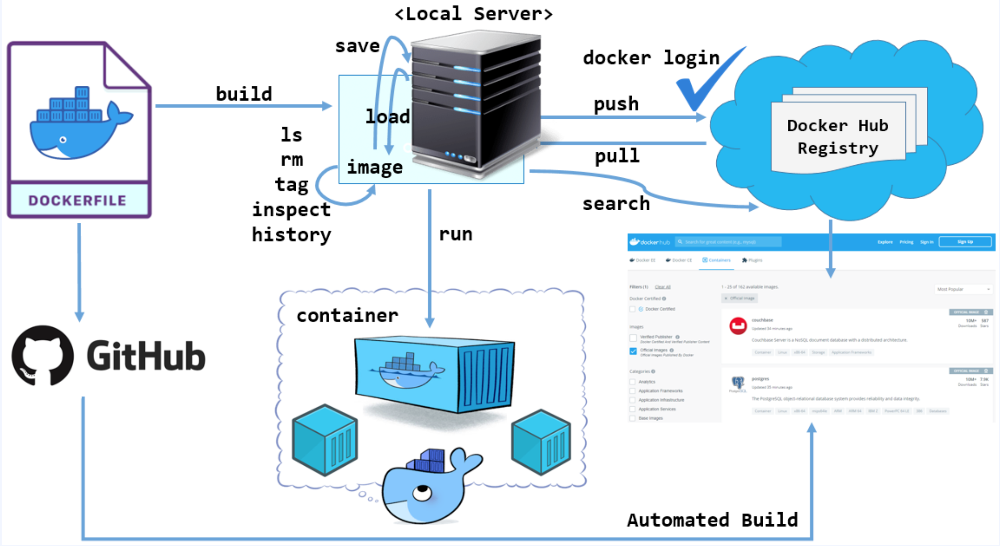
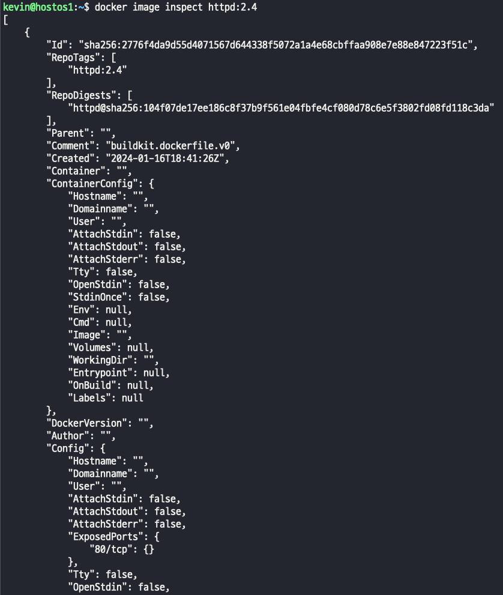
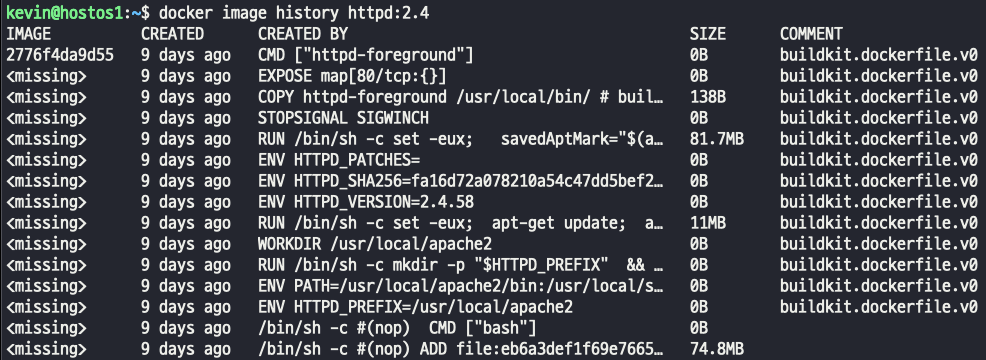

Docker Image에 대한 이해 

### docker 서비스를 위한 image
1) docker image는 Container runtime에 필요한 바이너리, 라이브러리 및 설정 값 등을 포함하고, 변경되는 상태값을 보유하지 않고(statelsess) 변하지 않는다 (Immutable, ReadOnly)   
-> docker hub 에서 다운로드한 이미지는 수정할 수 없다.   
단, 다운로드한 이미지는 컨테이너화 후 변경된 부분을 포함해서 다시 빌드해서 신규 이미지로 만드는것은 가능하다. 
2) 일반적인 컨테이너 애플리케이션 서비스 개발 과정은 이미지와 같다.
   

이미지와 같은 과정을 자동화하면 CI/CD가 되는것이다.

### 기본적인 docker image workFlow

- 이미지를 조회하고, 파악하고, docker Hub Registry에서 이미지를 pull, push

### 이미지 내려 받기 
- Docker는 hub.docker.com(docker.io)으로 부터 이미지를 제공 받거나 제공한다.
- 또는, 기업의 인프라에 개별적인 Private registry 서버를 두고, 이미지를 관리한다.
- 기본적으로 Docker.io가 default registry로 등록 되어 있다
- docker [image] pull [options] name:[tag]
> ***따로 tag나 options를 명시하지 않으면 최신버전이 다운된다***  
> docker pull debian[:latest]  
> docker library/debian:10
> 
> ***만약 private registry나 클라우드의 저장소(ECR, GCR)의 이미지를 받는다면?***  
> docker pull [IP]:[PORT]/debian:10  
> docker pull gcr.io/google-samples/hello-app:1.0   
> -> gcr 에서 공개한 무료 이미지   
>
> ***localRegistry의 기본 Port는 5000이다***  
> docker pull 172.198.0.1:5000/debian:10  

### 이미지 구조 확인
- docker image inspect : 생성된 image의 내부 구조 정보를 JSON 형태로 제공한다. 
- docker image는 기본적으로 레이어 구조로 되어있다. 
> docker image inspect [image]
> 
> 주요 정보 : id, 생성일, DockerVersion, CPU 아키텍쳐, 이미지 다이제스트 정보, 이미지 레이어 저장 정보   
> 다이제스트란 식별자를 의미한다.
>
> ### 필요한 정보만 확인하고 싶을땐? ###
> inspect를 검색하면 전체적인 json의 tree 구조로 되어있다.
> 스텝 레벨에 따라 선택이 되기 때문에 format 옵션을 사용해서 경로를 지정해서 확인해야 한다.  
> docker image inspect --format="{{.Os}}" httpd:2.4  
> docker image inspect --format="{{.ContainerConfig.ExposedPorts}}" httpd:2.4
> 
> 두가지 정보를 확인하고 싶으면 원하는 정보 두가지를 넣는다.   
> docker image inspect --format="{{.RepoTags}} {{.Os}}" httpd:2.4 
>  
> 

  
### docker history
- docker image는 Dokcerfile을 통해 build된다.  
- image inspect는 이미지 파일에 대한 배경 정보라고 생각한다면, history는 dockerFile과 관련된다.  
> 
> docker history 조회 결과에서 CMD, EXPOSE, COPY, ENV, WORKDIR 등 은 모두 ***dockerfile에 파라메터임***  
> port를 사용하는 이미지는 반드시 EXPOSE를 확인해야한다.

### docker layer
- 이미지를 pull 하는 과정에서 이미지가 계층(layer) 구조라는 것을 확인할 수 있다. 
>    
> httpd2.4 는 총 다섯개의 레이어로 구성되어 있다.  
> 
> - 이미지 레이어 구성은 각 구성마다 역할이 있다.  
> - 이미지마다 다르고 역할도 다르다
> - 이미지는 불변이다. 이미지에 웹소스던 어떤 부분에 뭔가 추가해서 이미지를 생성하면 ***신규 레이어가 추가***되는것이다.   
> f03b40093957: Pull complete … layer 5 → 웹 소스  
> abaf8619eb1c: Pull complete … layer 4 → httpd 서버    
> e3fe37d0c2ad: Pull complete … layer 3 → OS 계층  
> 52a1e37affe5: Pull complete … layer 2 → OS 계층  
> 49d8a68fd903: Pull complete … layer 1 → OS 계층  

### download된 layer들은 어디에 있을까 
- download된 Layer들은 distribution ID를 부여 받고 docker 전용 경로에 저장된다. 
- /var/lib/docker/image/overlay2/distribution/diffid-by-digest/sha256/
> docker 본체 경로 : /var/lib/docker/  
> Pull 받은 이미지는 결국 file로 생성된다. : /image/overlay2 (storageDriver) 경로에    
> /distribution/diffid-by-digest/sha256/ : digest 값으로 구분된다.

 # 정리
- 이미지는 불변 즉, Read only 형태로 만들어지고
- docker run 명령어로 컨테이너를 생성하면 [Container layer]가 read write로 추가된다.  

> 